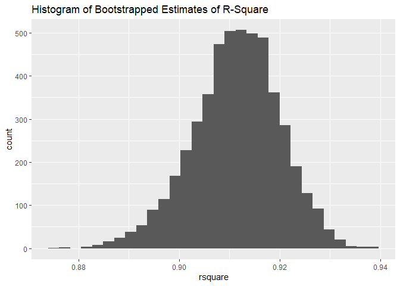
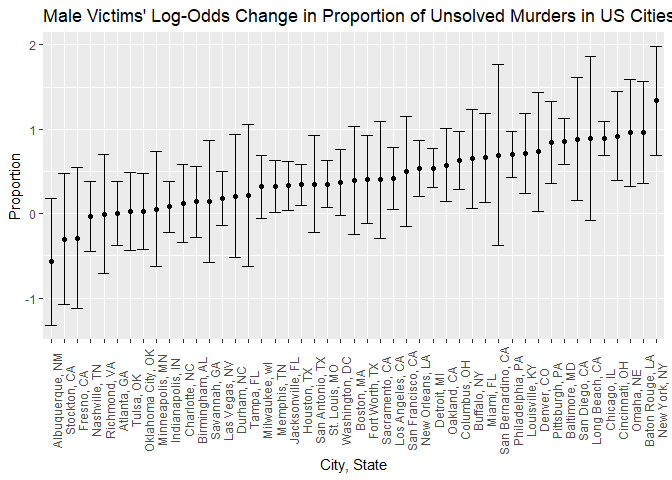
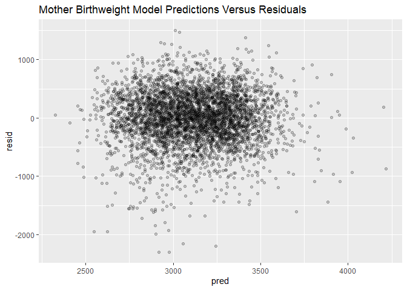
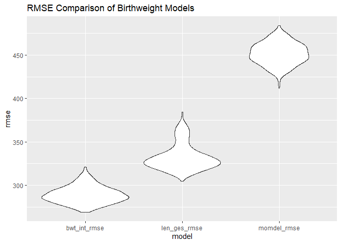

HW 6
================
Wayne Monical
2024-12-02

``` r
library(tidyverse)
library(glmnet)
library(modelr)
library(purrr)
```

## Problem 1

Reading in data

``` r
weather_df = 
  read_csv('weather_df.csv')
```

We begin by loading in the data, regressing tmax on tmin with
bootstrapped samples to obtain a bootstrapped estimate of
$log(\beta_0 * \beta_1)$ and r-squared.

``` r
weather_bootstrap = 
  weather_df |> 
  modelr::bootstrap(n = 5000) |> 
  mutate(
    models = map(strap, \(df) lm(tmax ~ tmin, data = df) ),
    results = map(models, broom::tidy), 
    rsquare = map2(models, strap, modelr::rsquare)
    ) |> 
  select(-strap, -models) |> 
  unnest(results, rsquare)
```

    ## Warning: `unnest()` has a new interface. See `?unnest` for details.
    ## ℹ Try `df %>% unnest(c(results, rsquare))`, with `mutate()` if needed.

We find that the distribution of the bootstrapped estimate for
$log(\beta_0 * \beta_1)$ are approximately normal. We find that the
2.5th and 97.5th percentiles of the bootstrapped samples of
$log(\beta_0 * \beta_1)$ are 1.965654 and 2.058656 respectively. These
values also constitute a 95% bootstrapped confidence interval for the
value.

``` r
log_df = 
  weather_bootstrap |> 
  pivot_wider(id_cols = .id,
              names_from = term,
              values_from = estimate) |> 
  mutate(
    log_b0_b1 = log( `(Intercept)` * tmin)
  )

log_df |> 
  ggplot(aes(x = log_b0_b1)) + 
  geom_histogram()+
  ggtitle("Histogram of Bootstrapped Estimates of Log(B_0 * B_1)")
```

<!-- -->

``` r
log_df |> 
  summarize(
    quantile_2.5 = quantile(log_b0_b1, 0.025),
    quantile_97.5 = quantile(log_b0_b1, 0.975)
  ) |> 
  knitr::kable()
```

| quantile_2.5 | quantile_97.5 |
|-------------:|--------------:|
|     1.965008 |      2.058654 |

We find that the distribution of the bootstrapped estimate for r-sqaured
are approximately normal. We find that the 2.5th and 97.5th percentiles
of the bootstrapped samples of r-squared are 0.8932868 and 0.9269325
respectively. These values also constitute a 95% bootstrapped confidence
interval for the value.

``` r
rsquare_df = 
  weather_bootstrap |> 
  select(.id, rsquare) |> 
  distinct() 


rsquare_df |> 
  ggplot(aes(x = rsquare)) + 
  geom_histogram()+
  ggtitle("Histogram of Bootstrapped Estimates of R-Square")
```

<!-- -->

``` r
rsquare_df |> 
  summarize(
    quantile_2.5 = quantile(rsquare, 0.025),
    quantile_97.5 = quantile(rsquare, 0.975)
  ) |> 
  knitr::kable()
```

| quantile_2.5 | quantile_97.5 |
|-------------:|--------------:|
|    0.8929261 |     0.9275998 |

## Problem 2

We begin by reading in the homicide data. We create the `city_state`
variable, using code from homework 5, and filter the data for relevant
cities and `victim_race`. We drop non-numeric values from `victim_age`.

``` r
homicide = 
  read_csv('homicide-data.csv') |> 
  mutate(
    city_state = paste0(city, ", ", state),
    unsolved = disposition %in% c(
      'Closed without arrest',
      'Open/No arrest')) |> 
  filter(
    ! city_state %in% c(
      'Dallas, TX', 
      'Phoenix, AZ',
      'Kansas City, MO',
      'Tulsa, AL'),
    victim_race %in% c('White', 'Black'),
    victim_age != 'Unknown'
  ) |> 
  mutate(
    victim_age = as.numeric(victim_age)
  )
```

### Baltimore

To evaluate the data for one city, we filter for Baltimore, MD.

``` r
baltimore = 
  homicide |>
  filter(city_state == 'Baltimore, MD')
```

We fit a logistic GLM for solved versus unsolved murders. Holding all
other variables fixed, we find that male homicide victims in Baltimore,
MD have a log odds ratio of 0.8545 higher than a female victims of
having an unsolved murder. A 95% confidence interval for this increase
is 0.5836 to 1.125 given by the calculation below.

``` r
baltimore_glm = 
  glm(
    formula = unsolved ~ victim_age + victim_sex + victim_race,
    data = baltimore,
    family = binomial())

broom::tidy(baltimore_glm) |> 
  filter(term == 'victim_sexMale') |> 
  select(term ,estimate, std.error) |> 
  knitr::kable()
```

| term           |  estimate | std.error |
|:---------------|----------:|----------:|
| victim_sexMale | 0.8544628 | 0.1381762 |

Calculating the confidence interval

``` r
0.85446 - 0.13817619 * 1.96
```

    ## [1] 0.5836347

``` r
0.85446 + 0.13817619 * 1.96
```

    ## [1] 1.125285

### All Cities

We repeat the exercise with all cities by nesting the data, fitting a
logistic regression model to each city’s data, getting their estimates
and standard errors for the log-odds change of male victims, and using
the estimates and standard errors to create 95% confidence intervals.

``` r
unsolved =
  homicide |> 
  nest(data = -city_state) |> 
  mutate(unsolved_glm = map(data, 
                        \(x) glm(
                          formula = unsolved ~ victim_age + victim_sex + victim_race,
                          data = x,
                          family = binomial())
                        ),
         test_results = map(unsolved_glm, \(x) broom::tidy(x)),
         ) |> 
  unnest(cols = test_results) |> 
  filter(term == 'victim_sexMale') |> 
  select(
    city_state, estimate, std.error
  ) |> 
  mutate(
    lower_CI = estimate - 1.96 * std.error,
    upper_CI = estimate + 1.96 * std.error
  )
```

Finally, we plot estimates and the confidence intervals for each city.
In the vast majority of US cities, the estimated log-odds change of male
murder victims’ proportion of unsolved cases is positive. In other
words, in most cities’ samples, males have a higher likelihood of their
murders not being solved. Since this data is not from a random sample
and is not a census, any conclusions we draw from statistical tests may
be flawed. With that caveat, it should be noted that many cities’
confidence intervals are large enough to contain zero. In these cities,
we do not have enough evidence to conclude that male murders are less
likely to be solved. Since we are creating a model for each city, we
should consider implementing the Bonferroni correction to the alpha
value of 0.05.

``` r
unsolved |> 
  ggplot(aes(
    x = reorder(city_state, estimate),
    y = estimate))  +  
  geom_point() + 
  geom_errorbar(aes(ymin = lower_CI, ymax = upper_CI))+
  theme(axis.text.x = element_text(angle = 90))+
  ggtitle("Male Victims' Log-Odds Change in Proportion of Unsolved Murders in US Cities") + 
  xlab('City, State') + 
  ylab('Proportion')
```

<!-- -->

## Problem 3

We begin by loading the irthweight data. We ensure that our categorical
variables with no true order (`mrace` and `frace`) are factors.

``` r
birthweight = 
  read_csv('birthweight.csv') |> 
  mutate(
    mrace = factor(mrace),
    frace = factor(frace)
  )
```

There are no missing values in the data frame.

``` r
sum(is.na(birthweight))
```

    ## [1] 0

We hypothesize that babies’ weights are under-lied by biological
characteristics of their mothers. In order to evaluate this claim, we
will create a linear model with all of the mother’s biological data with
no interaction terms and compare it to two other candidate models.

``` r
momdel_formula = 'bwt ~  delwt + menarche + mheight + momage + mrace + parity + pnumlbw + pnumsga + ppbmi + ppwt + smoken + wtgain'

momdel = 
  lm(formula = momdel_formula,
    data = birthweight)
```

Fitting the model and plotting the residuals against the predictions
with the `add_predictions` and `add_residuals` functions, there is no
apparent interaction. This is an indication that the choice of model may
be correct.

``` r
birthweight |> 
  add_predictions(momdel) |> 
  add_residuals(momdel) |> 
  ggplot(aes(x = pred, y = resid)) + 
  geom_point(alpha = 0.2)+
  ggtitle("Mother Birthweight Model Predictions Versus Residuals")
```

<!-- -->

### Comparing Models

The mother birth weight model will be compared against two models. The
first will regress birth weight on length at birth and gestational age.
The second model will regress birth weight on head circumference at
birth, birth length, sex, and all third order interaction terms.

We begin by creating 500 re-sampled test/train splits. We train each
model on this data. We then get the root mean square error of all models
on their test data. Then, we may evaluate the root mean square errors.

``` r
set.seed(123)

model_comparison =   
  birthweight |> 
  crossv_mc(n = 500) |> 
  mutate(
    momdel = map(train, \(df) lm(momdel_formula, data = df)),
    len_ges = map(train, \(df) lm(bwt ~ blength + gaweeks, data = df)),
    bwt_int = map(train, \(df) lm(bwt ~ (bhead + blength + babysex)^3, data = df)),
    momdel_rmse = map2_dbl(momdel, test, ~rmse(.x, .y)),
    len_ges_rmse = map2_dbl(len_ges, test, ~rmse(.x, .y)),
    bwt_int_rmse = map2_dbl(bwt_int, test, ~rmse(.x, .y)),
    ) |> 
  select(momdel_rmse, len_ges_rmse, bwt_int_rmse) |> 
  pivot_longer(
    cols = c('momdel_rmse', 'len_ges_rmse', 'bwt_int_rmse'),
    names_to = 'model',
    values_to = 'rmse'
  )
```

    ## Warning: There were 6 warnings in `mutate()`.
    ## The first warning was:
    ## ℹ In argument: `momdel_rmse = map2_dbl(momdel, test, ~rmse(.x, .y))`.
    ## Caused by warning in `predict.lm()`:
    ## ! prediction from rank-deficient fit; attr(*, "non-estim") has doubtful cases
    ## ℹ Run `dplyr::last_dplyr_warnings()` to see the 5 remaining warnings.

``` r
model_comparison |> 
  ggplot(aes(x = model, y = rmse))+
  geom_violin()+
  ggtitle('RMSE Comparison of Birthweight Models')
```

<!-- -->
